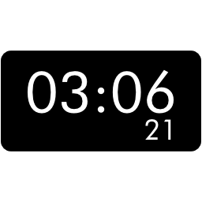

<h1> VRCOSC Digital Clock</h1>

A digital clock module for [VRCOSC] based on the original [ClockModule].
It provides 3 `float` parameters (for hours, minutes and seconds) mapped to the range 0-59 for animating the digits of a digital clock.

A prefab is provided with a basic digital clock setup and a default digits texture using the [Gontserrat] font

[VRCOSC]: https://github.com/VolcanicArts/VRCOSC
[ClockModule]: https://github.com/VolcanicArts/VRCOSC/blob/2023.601.0/VRCOSC.Modules/Clock/ClockModule.cs
[Gontserrat]: https://www.dafont.com/gontserrat.font
